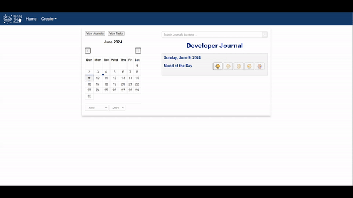

# cse110-sp24-group28 Final Project: Developer Journal

## Important Links

Application (GitHub Pages): https://cse110-sp24-group28.github.io/cse110-sp24-group28-final-project/  
JSDoc: https://cse110-sp24-group28.github.io/cse110-sp24-group28-final-project/documentation  
Coverage Report: https://cse110-sp24-group28.github.io/cse110-sp24-group28-final-project/coverage/lcov-report/index.html

---

## Setup Instructions for Developers

After cloning the repository, please install npm:
https://docs.npmjs.com/downloading-and-installing-node-js-and-npm#using-a-node-version-manager-to-install-nodejs-and-npm

Then, run `npm i` to install packages.

If you want prettier to format on save, you also need to configure your IDE to run it:
- For vscode, install the prettier extension: https://marketplace.visualstudio.com/items?itemName=esbenp.prettier-vscode
- For webstorm, go to preferences and enable format on save.

In order to run the application, just run the command ```npm run dev``` rather than using vscode's live server extension (to keep things consistent between team members).

If you want the latest documentation, run ```npm run document``` and it will generate in a folder called documentation.

If you want an up to date coverage report, run ```npm run coverage``` and it will generate in a folder called coverage.

---

## File and Directory Information

`src/`: Contains the source code of the application.
- `src/index.html` is the main page.
- `src/journal.html` is the journal creation screen.
- `src/localStorageHelper.js` contains helper functions to interface with localStorage.
- `src/script.js` contains the main Javascript for the app (functions and event listeners).
- `src/styles.css` contains the CSS code for the app.
- `src/task.html` is the task creation screen.
- `src/utils.js` contains a utility function that generates random IDs for journals.

`src/components/`: Contains separate containerized features of the application. 
- `src/components/search.js` contains the Javascript code for the search bar in the app.

`src/tests/`: Contains end-to-end and unit tests for the application.
- `src/e2eTests/` contains end-to-end tests.
- `src/unitTests/` contains unit tests.

---

## Demo


